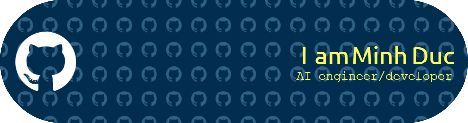

<!-- Profile Cover -->

  

<h3 align="center">
  I'm an AI Engineer with a strong interest in machine learning, deep learning, and building real-world intelligent systems. I enjoy turning data into insights, training models that make decisions, and exploring the boundaries of human–AI collaboration.
</h3>

<h4 align="center">
  🌐 Visit my portfolio: <a href="https://minhduc123234.github.io/my-porforlio/" target="_blank">https://minhduc123234.github.io/my-porforlio/</a>
</h4>

<!-- Profile View Counter -->

  

<!-- Trophy -->

  

<!-- Social -->
<h3 align="left">Connect with me:</h3>

  
  

<!-- Tools -->
<h3 align="left">Languages and Tools:</h3>

  
  
  
  
  
  
  

<!-- Stats -->

  

&nbsp;

<!-- Snake animation -->
<h3 align="center">🐍 Watch my contributions snake 🐍</h3>

  

